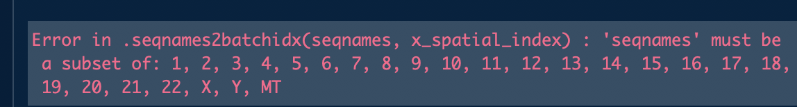

```{r setup_varManS2, include=FALSE}
knitr::opts_chunk$set(echo = TRUE,cache = TRUE,cache.lazy = FALSE)
# AsSlides <- TRUE
#
suppressPackageStartupMessages(library(VariantAnnotation))
suppressPackageStartupMessages(library(DT))
suppressPackageStartupMessages(library(BSgenome.Hsapiens.UCSC.hg19))
suppressPackageStartupMessages(library(TxDb.Hsapiens.UCSC.hg19.knownGene))
suppressPackageStartupMessages(library(SNPlocs.Hsapiens.dbSNP144.GRCh37))
suppressPackageStartupMessages(library(ggplot2))
vcf <- readVcf("../data/SAMN01882168_filt.vcf.gz","hg19")
rd <- rowRanges(vcf)
```

## Annotate variantions
- Required resources
- Retrive dbSNP ID
- Predict amino acid changes

---
## Required resources
- [dbSNP](https://bioconductor.org/packages/release/data/annotation/html/SNPlocs.Hsapiens.dbSNP144.GRCh37.html)
- [Reference Genome](http://bioconductor.org/packages/release/data/annotation/html/BSgenome.Hsapiens.UCSC.hg19.html)
- [Annotation](https://bioconductor.org/packages/release/data/annotation/html/TxDb.Hsapiens.UCSC.hg19.knownGene.html)

```{r annoRS_varMan}
library(BSgenome.Hsapiens.UCSC.hg19)
library(TxDb.Hsapiens.UCSC.hg19.knownGene)
library(SNPlocs.Hsapiens.dbSNP144.GRCh37)
```

---
## Predict amino acid changes with TxDb
```{r aaCh_varMan}
txdb <- TxDb.Hsapiens.UCSC.hg19.knownGene
```

---
## TxDb
```{r aaCh_varMan_txdb}
txdb
```

---
## Predict amino acid changes ~ Failed
```{r aaCh_varMan_pred}
coding <- predictCoding(vcf, txdb, seqSource=Hsapiens)
```

---
## Predict amino acid changes ~ present
```{r aaCh_varMan_pres2}
coding[1]
```

---
## Transform into data frame
```{r aaCh_varMan_frame,eval=FALSE,tidy=FALSE,echo=TRUE}
matA <- data.frame(Variant=names(coding),
                   chromosome=seqnames(coding),
                   start=start(coding),end=end(coding),
                   ref_allele=as.character(coding$REF),
                   alt_allele=unlist(lapply(lapply(
                     coding$ALT,`[[`,1),as.character)),
                   GeneID=coding$GENEID,
                   Protein_posi=unlist(lapply(lapply(
                     coding$PROTEINLOC,`[[`,1),as.integer)),
                   ref_AA=as.character(coding$REFAA),
                   alt_AA=as.character(coding$VARAA),
                   Type=coding$CONSEQUENCE,
                   stringsAsFactors = FALSE)
matA$aaChange <- paste0("p.",matA$ref_AA,matA$Protein_posi,matA$alt_AA)
matA <- dplyr::select(matA,-Protein_posi,-ref_AA,-alt_AA)
```

---
## Annotation table ~ Amino Acid Changes
```{r aaCh_varMan_tbl}
matA[1:2,]
```

---
## How many variations in coding region
```{r aaCh_varMan_muCt}
var_in_coding <- data.frame(varName=names(vcf),
                            in_coding=names(vcf) %in% matA$Variant,
                            stringsAsFactors = FALSE)
table(var_in_coding$in_coding)
```

---
## How many types of variations in coding region
```{r aaCh_varMan_muType}
taC <- table(matA$Type)
taC_dat <- as.data.frame(taC)
taC
```

---
## Variant types in coding region
```{r aaCh_varMan_muType_disp1,tidy=FALSE,echo=TRUE,eval=FALSE}
ggplot(taC_dat,aes(x=Var1,y=Freq,fill=Var1))+
  geom_bar(stat='Identity')+
  labs(x="",y="Counts",fill="")+
  theme(legend.position = "none")
```

---
## Variant types in coding region
```{r aaCh_varMan_muType_disp2,tidy=FALSE,echo=FALSE,eval=TRUE,fig.align="center"}
ggplot(taC_dat,aes(x=Var1,y=Freq,fill=Var1))+
  geom_bar(stat='Identity')+
  labs(x="",y="Counts",fill="")+
  theme(legend.position = "none")
```

---
## Retrive dbSNP data
```{r dbSNPv_varMan}
all_snps <- SNPlocs.Hsapiens.dbSNP144.GRCh37
all_snps
```

---
## Generate SNPs by chromosome
```{r dbSNPv_varMan_load_fail,eval=FALSE}
tar_chr <- as.vector(seqnames(rd)@values)
my_snps <- snpsBySeqname(all_snps,c(tar_chr))
```
```{r dbSNPv_varMan_load_fail2,eval=TRUE,echo=FALSE,fig.align="center",out.width="75%"}

```

---
## What's wrong?
- **seqlevels** in the two objects dosn't match
- **seqlevelStyle** in the two objects dosn't match
- **genome** in the tow objects dosen't match

---
## check seqlevels
```{r check_seqLvl}
# seqlevels ~ rd
seqlevels(rd)
# seqlevels ~ dbSNP
seqlevels(all_snps)
```

---
## check seqlevelStyle
```{r check_seqStyle}
seqlevelsStyle(rd)
seqlevelsStyle(all_snps)
```

---
## check genome
```{r check_genome}
genome(rd)
genome(all_snps)
```

---
## Generate SNPs by chromosome
```{r dbSNPv_varMan_load}
tar_chr <- as.vector(seqnames(rd)@values)
tar_chr <- gsub("chr","",tar_chr)
tar_chr[grepl(tar_chr,pattern = "M")] <- "MT"
my_snps <- snpsBySeqname(all_snps,c(tar_chr))
my_snps[1:2]
```

---
## Replace seq Info of my_snps
```{r change_seqlvl}
# change seqlevels
seqlevels(my_snps) <- paste0("chr",seqlevels(my_snps))
seqlevels(my_snps) <- gsub("MT","M",seqlevels(my_snps))
# change seqlevelsStyle
seqlevelsStyle(my_snps) <- "UCSC"
# change genome
genome(my_snps) <- "hg19"
```

---
## Make rsID table
```{r makeTab_varMan}
snp_ID <- data.frame(
  posIDX=paste0(seqnames(my_snps),":",pos(my_snps)),
  rsID=my_snps$RefSNP_id,stringsAsFactors = FALSE)
head(snp_ID)
```

---
## Generate Variant table
```{r dbSNPV_varMan_tbl_1}
matV1 <- data.frame(Variant=names(rd),stringsAsFactors = FALSE)
matV1$chromosome <- gsub("(.*):(.*)_(.*)/(.*)","\\1",matV1$Variant)
matV1$start <- gsub("(.*):(.*)_(.*)/(.*)","\\2",matV1$Variant)
matV1$end <- gsub("(.*):(.*)_(.*)/(.*)","\\2",matV1$Variant)
matV1$ref_allele <- gsub("(.*):(.*)_(.*)/(.*)","\\3",matV1$Variant)
matV1$alt_allele <- gsub("(.*):(.*)_(.*)/(.*)","\\4",matV1$Variant)
matV1$posIDX <- gsub("(.*)_(.*)","\\1",matV1$Variant)
matV1[1:2,]
```

---
## Annotation table ~ SNP_ID
```{r dbSNPV_varMan_tbl_3,tidy=FALSE}
matS <- merge(matV1,snp_ID,all.x=TRUE,by="posIDX")
matS <- dplyr::select(matS,-posIDX)
matS[1:2,]
```

---
## How many variations in dbSNP
```{r dbSNPV_varMan_muCt,tidy=FALSE}
taC2 <- table(!is.na(matS$rsID))
taC2_dat <- as.data.frame(taC2)
taC2
```

---
## Variations in dbSNP ~ Plotting
```{r dbSNPv_varMan_muCt_disp1,tidy=FALSE,eval=FALSE,echo=TRUE}
ggplot(taC2_dat,aes(x=Var1,y=Freq,fill=Var1))+
  geom_bar(stat='Identity')+
  labs(x="",y="Counts",fill="in_dbSNP")+
  theme(legend.position = "none")
```

---
## Variations in dbSNP ~ Plotting
```{r dbSNPv_varMan_muCt_disp2,tidy=FALSE,echo=FALSE,eval=TRUE,fig.align="center"}
ggplot(taC2_dat,aes(x=Var1,y=Freq,fill=Var1))+
  geom_bar(stat='Identity')+
  labs(x="",y="Counts",fill="in_dbSNP")+
  theme(legend.position = "none")
```

---
## Add Gene and AAChange
```{r comb_varMan}
matS$GeneID <- matA$GeneID[match(matS$Variant,matA$Variant)]
matS$AAChange <- matA$GeneID[match(matS$Variant,matA$Variant)]
matS[1:2,]
```

---
## Other annotation softwares
- [ANNOVAR](https://doc-openbio.readthedocs.io/projects/annovar/en/latest/)
- [SnpEff](http://snpeff.sourceforge.net/)

---
## Excercises