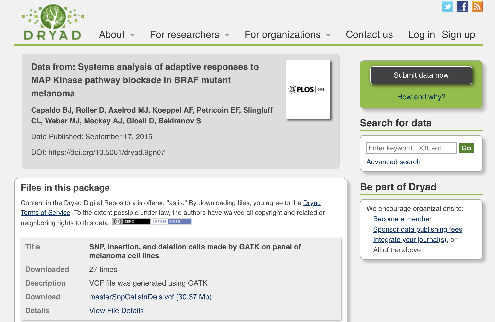
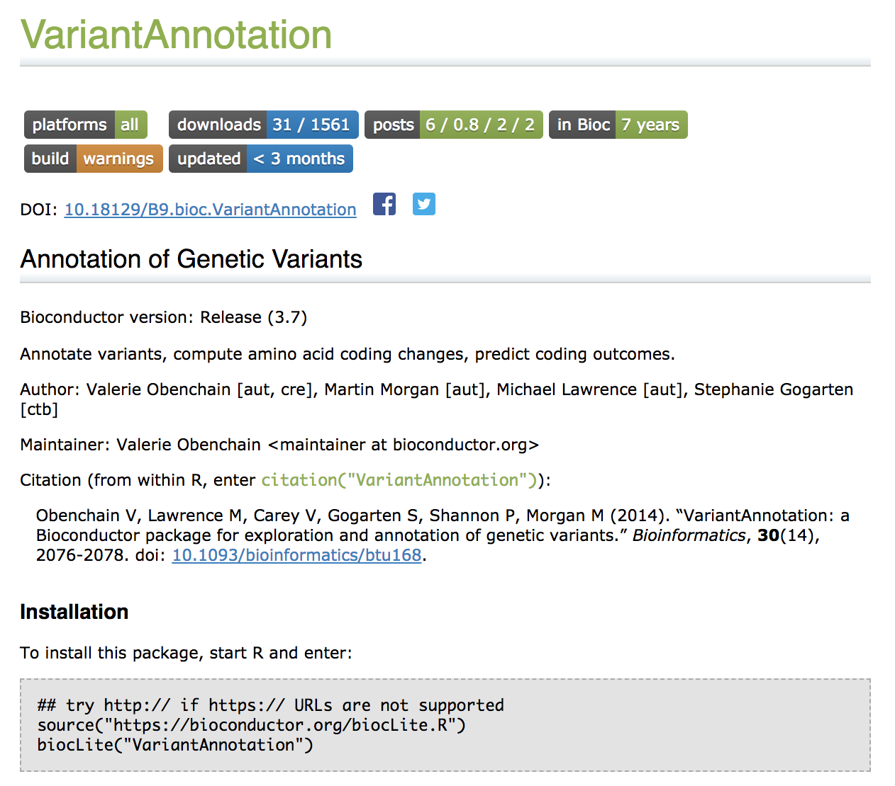
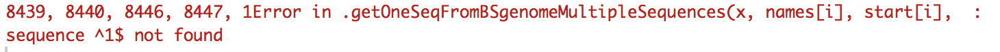
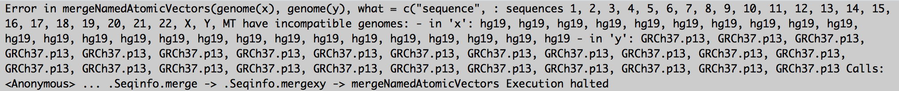

```{r setup_varMan, include=FALSE}
knitr::opts_chunk$set(echo = TRUE,cache = TRUE,cache.lazy = FALSE)
AsSlides <- TRUE
#
suppressPackageStartupMessages(library(VariantAnnotation))
suppressPackageStartupMessages(library(DT))
suppressPackageStartupMessages(library(BSgenome.Hsapiens.UCSC.hg19))
suppressPackageStartupMessages(library(TxDb.Hsapiens.UCSC.hg19.knownGene))
suppressPackageStartupMessages(library(SNPlocs.Hsapiens.dbSNP144.GRCh37))
suppressPackageStartupMessages(library(ggplot2))
```

## Outline
- Manipulate VCF files
- Annotate variants
- Output results

---
## Dataset
<div align="center">

</div>

---
## Manipulate VCF files
- Install and load VariantAnnotation package
- Load vcf file 
- General inforamtion in the vcf
- Variants in VRange format
- Information field
- Genotype field

---
## [VariantAnnotation](https://bioconductor.org/packages/release/bioc/html/VariantAnnotation.html)
<div align="center">

</div>

---
## VariantAnnotation ~ load
```{r vaLoad_varMan}
library(VariantAnnotation)
```

---
## Load vcf file
```{r vcfLoad_varMan}
vcf <- readVcf("data/masterSnpCallsInDels.vcf","hg19")
```

---
## vcf file overview
```{r vcf_overview_varMan}
vcf
```

---
## General information
```{r gInfo_varMan}
header(vcf)
```

---
## How many samples in this vcf?
```{r sample_varMan}
sampleID <- samples(header(vcf))
sampleID
length(sampleID)
```

---
## Metadata field
```{r meta_varMan}
meta(header(vcf))$META
```

---
## Reference genome
```{r meta_refG_varMan}
ref_geno <- as.matrix(meta(header(vcf))$reference)
basename(ref_geno[rownames(ref_geno)=="reference"])
```

---
## Contigs and length
```{r meta_contig_varMan}
meta(header(vcf))$contig
```

---
## Variants information (VRange format)
```{r range_varMan}
rd <- rowRanges(vcf)
rd[1:3]
```

---
## Position of the variations
- chromosome: seqnames()
- start position: start()
- end position: end()
```{r range_varMan_posi}
seqnames(rd)[1:2]
start(rd)[1:2]
end(rd)[1:2]
```
---
## Reference/Alternative Allele
- reference allele is a vector: ref()
- alternative allele is a list: alt()
```{r range_varMan_baseInfo}
ref(vcf)[1:2]
alt(vcf)[1:2]
```
---
## Information field ~ Description
```{r info_varMan}
info(header(vcf))
```

---
## Information field
```{r info_varMan_disp}
info(vcf)
```

---
## Genotype information ~ Description
```{r geno_varMan}
geno(header(vcf))
```

---
## Genotype information ~ GT
```{r genoGT_varMan}
paste0("GT: ",geno(header(vcf))[1,3])
matGT <- geno(vcf)$GT
matGT[1:5,1:4]
```

---
## GT Types
```{r genoGT_varMan_tbl}
type_GT <- as.vector(as.matrix(matGT))
type_GT[type_GT=="."] <- "NA"
taC <- table(type_GT)
taC
```

---
## GT Types ~ plot
```{r genoGT_varMan_disp,tidy=FALSE,fig.height=4.5,fig.width=9}
matD <- data.frame(varType=as.vector(names(taC)),
                   Count=as.vector(taC))
ggplot(matD,aes(x=varType,y=Count))+geom_bar(stat='Identity')+
  labs(x="",y="Counts",title="Types of variations")+theme_classic()
```

---
## Genotype information ~ DP
```{r genoDP_varMan}
paste0("DP: ",geno(header(vcf))[2,3])
matDP <- geno(vcf)$DP
matDP[1:5,1:4]
```

---
## DP Distribution
```{r genoDP_varMan_dist,fig.height=4.5,fig.width=9}
dist_DP <- as.vector(as.matrix(matDP))
dist_DP <- dist_DP[!is.na(dist_DP)]
hist(dist_DP,xlab="Depth",main="")
```

---
## Genotype information ~ GQ
```{r genoGQ_varMan}
paste0("GQ: ",geno(header(vcf))[3,3])
matGQ <- geno(vcf)$GQ
matGQ[1:5,1:4]
```

---
## GQ Distribution
```{r genoGQ_varMan_dist,fig.height=4.5,fig.width=9}
dist_GQ <- as.vector(as.matrix(matGQ))
dist_GQ <- dist_GQ[!is.na(dist_GQ)]
hist(dist_GQ,xlab="Quality",main="")
```

---
## Annotate variantions
- Required resources
- Retrive dbSNP ID
- Predict amino acid changes

---
## Required resources
- [dbSNP](https://bioconductor.org/packages/release/data/annotation/html/SNPlocs.Hsapiens.dbSNP144.GRCh37.html)
- [Reference Genome](http://bioconductor.org/packages/release/data/annotation/html/BSgenome.Hsapiens.UCSC.hg19.html)
- [Annotation](https://bioconductor.org/packages/release/data/annotation/html/TxDb.Hsapiens.UCSC.hg19.knownGene.html)

```{r annoRS_varMan}
library(BSgenome.Hsapiens.UCSC.hg19)
library(TxDb.Hsapiens.UCSC.hg19.knownGene)
library(SNPlocs.Hsapiens.dbSNP144.GRCh37)
```

---
## Predict amino acid changes with TxDb
```{r aaCh_varMan}
txdb <- TxDb.Hsapiens.UCSC.hg19.knownGene
```

---
## TxDb
```{r aaCh_varMan_txdb}
txdb
```

---
## Predict amino acid changes ~ Failed
```{r aaCh_varMan_pred_oops,eval=FALSE}
coding <- predictCoding(vcf, txdb, seqSource=Hsapiens)
```
<div align="center">

</div>

---
## What's wrong?
- **seqlevels** in the two objects dosn't match
- **seqlevelStyle** in the two objects dosn't match

---
## Check seqlevels
```{r aaCh_varMan_seqLVL}
seqlevels(vcf)[1:5]
seqlevels(txdb)[1:5]
```

---
## Change seqlevels
```{r aaCh_varMan_seqLVL_ch}
seqlevels(txdb) <- gsub("chr","",seqlevels(txdb))
```

---
## Check seqlevelStyle
```{r aaCh_varMan_seqSty}
seqlevelsStyle(vcf)
seqlevelsStyle(txdb)
seqlevelsStyle(Hsapiens)
```

---
## Change seqlevelStyle
```{r aaCh_varMan_chseqSty}
seqlevelsStyle(Hsapiens) <- "NCBI"
```

---
## Predict amino acid changes ~ again
```{r aaCh_varMan_pred}
coding <- predictCoding(vcf, txdb, seqSource=Hsapiens)
```

---
## Predict amino acid changes ~ present
```{r aaCh_varMan_pres2}
coding[1]
```

---
## Transform into data frame
```{r aaCh_varMan_frame}
alt_base<-NULL;alt_AA<-NULL;prot_posi<-NULL;
for(i in 1:length(names(coding))){
  alt_base <- c(alt_base,paste(as.vector(coding$ALT[[i]]),collapse = ","))
  alt_AA <- c(alt_AA,paste(as.vector(coding$VARAA[[i]]),collapse = ","))
  prot_posi <- c(prot_posi,paste(as.vector(coding$PROTEINLOC[[i]]),collapse = ","))}
#
matA <- data.frame(Variant=names(coding),
                   chromosome=seqnames(coding),
                   start=start(coding),end=end(coding),
                   ref_allele=as.vector(coding$REF),
                   alt_allele=alt_base,
                   GeneID=coding$GENEID,
                   Protein_posi=prot_posi,
                   ref_AA=as.vector(coding$REFAA),
                   alt_AA=alt_AA,
                   Type=coding$CONSEQUENCE)
```

---
## Annotation table ~ Amino Acid Changes
```{r aaCh_varMan_tbl}
head(matA)
```

---
## How many variations in coding region
```{r aaCh_varMan_muCt}
var_in_coding <- data.frame(varName=names(vcf),
                            in_coding=names(vcf) %in% matA$Variant,
                            stringsAsFactors = FALSE)
table(var_in_coding$in_coding)
```

---
## How many types of variations in coding region
```{r aaCh_varMan_muType}
taC <- table(matA$Type)
taC
```

---
## Variant types in coding region
```{r aaCh_varMan_muType_disp,tidy=FALSE,fig.height=4.5,fig.width=9}
matD <- data.frame(varType=as.vector(names(taC)),
                   Count=as.vector(taC))
ggplot(matD,aes(x=varType,y=Count))+geom_bar(stat='Identity')+
  labs(x="",y="Counts",title="Types of variations")+theme_classic()
```

---
## Retrive dbSNP ID
```{r dbSNPv_varMan}
all_snps <- SNPlocs.Hsapiens.dbSNP144.GRCh37
all_snps
```

---
## Generate subsets of dbSNPs covering the variations
```{r dbSNPv_varMan_load}
tar_chr <- as.vector(seqnames(rd)@values)
my_snps <- snpsBySeqname(all_snps,c(tar_chr))
my_snps
```

---
## Annotate Variants in dbSNP
```{r dbSNPv_varMan_call_oops,eval=FALSE}
ext_dbSNP <- my_snps[my_snps %in% rd]
```
<div align="center">

</div>


---
## Annotate Variants in dbSNP
```{r dbSNPv_varMan_call}
genome(my_snps) <- "hg19"
ext_dbSNP <- my_snps[my_snps %in% rd]
ext_dbSNP[1:5]
```

---
## Generate index for Variant
```{r dbSNPV_varMan_tbl_1}
matV1 <- data.frame(Variant=names(rd))
matV1$posIDX <- gsub("(.*)_(.*)","\\1",matV1$Variant)
head(matV1)
```

---
## Generate index for SNP_ID
```{r dbSNPV_varMan_tbl_2}
snp_ID <- data.frame(posIDX=paste0(
  seqnames(ext_dbSNP),":",pos(ext_dbSNP)),
                     ext_dbSNP$RefSNP_id)
head(snp_ID)
```

---
## Annotation table ~ SNP_ID
```{r dbSNPV_varMan_tbl_3}
matS <- merge(matV1,snp_ID,all.x=TRUE,
              by.x=2,by.y=1)
matS <- dplyr::select(matS,Variant,ext_dbSNP.RefSNP_id)
names(matS) <- c("Variant","dbSNP_ID")
head(matS)
```

---
## How many variations in dbSNP
```{r dbSNPV_varMan_muCt,tidy=FALSE}
taC2 <- table(!is.na(matS$dbSNP_ID))
taC2
```

---
## Variations in dbSNP ~ Plotting
```{r dbSNPv_varMan_muCt_disp,tidy=FALSE,fig.height=4.5,fig.width=9}
matD <- data.frame(dbSNP=names(taC2),Count=as.vector(taC2))
ggplot(matD,aes(dbSNP,Count))+geom_bar(stat='Identity')+
  labs(x="",y="Counts",title="Variants in dbSNP")+theme_classic()
```

---
## Integrate annotation information
- Variations
- Amino acid change (matA)
- SNP_ID (matS)
- Information 
  + Genotype (matGT)
  + Depth (matDP)
  + Quality for genotypes (matGQ)

---
## Then..How to extract high-quality variations in a given sample?

Criteria for high-quality variations

- GT: 0/1 (heterozygous) or 1/1 (homozygous)
- DP: greater than or equal to 10
- GQ: greater than or equal to 30

---
## Integrated information 
```{r comb_varMan}
matC <- data.frame(Variant=names(vcf))
matC <- merge(matC,matA,all.x=TRUE,by=1)
matC <- merge(matC,matS,all.x=TRUE,by=1)
```

---
## Integrated information 
```{r comb_varMan_tbl}
head(matC)
```

---
## High-quality variations for sample 1
```{r subHQV_varMan}
gtP1 <- rownames(matGT)[which(matGT[,1]=="0/1" | matGT[,1]=="1/1")]
dpP1 <- rownames(matDP)[which(matDP[,1]>=10)]
gqP1 <- rownames(matGQ)[which(matGQ[,1]>=30)]
varP1 <- gtP1[which(gtP1 %in% dpP1 & gtP1 %in% gqP1)]
#
length(varP1)
```

---
## High-quality variations for sample 1
```{r subHQV_varMan_tbl}
matC_P1 <- matC[matC$Variant %in% varP1,]
matC_P1 <- cbind(matC,sampleID=sampleID[1])
head(matC_P1)
```

---
## Exercises
- [Exercise](./exercise_beta.html)
- [Answer](./answer_beta.html)